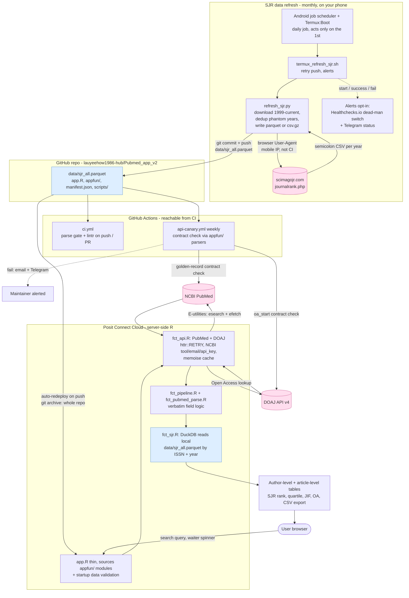

# NHCS PubMed Tracker

[](https://lauyh-901385432-pubmed-app-v2.share.connect.posit.cloud)
[](https://github.com/lauyeehow1986-hub/Pubmed_app_v2/actions/workflows/ci.yml)
[](https://shiny.posit.co/)

A Shiny dashboard that searches PubMed for **National Heart Centre Singapore (NHCS)**
publications and enriches each record with:

- author position, affiliations, Duke-NUS and JRI institute tagging, NHCS department
- DOAJ **Open Access** status
- **SCImago Journal Rank (SJR)** metrics — rank, SJR score, best quartile, H-index,
  cites/doc (2 years) "JIF", JIF category, and annual rank percentile

It runs server-side (R), so it makes live calls to the NCBI E-utilities and DOAJ APIs and
queries the SJR data with DuckDB.

## Architecture



The diagram has three lanes: the **monthly data refresh** (top — runs on your phone because
scimagojr.com blocks datacenter/CI IPs) which commits a fresh `data/sjr_all.parquet` to GitHub;
**GitHub Actions** (middle — CI parse/lint on every push, plus a weekly **API canary** that
contract-checks NCBI PubMed and DOAJ with the app's own parsers and emails/Telegrams you on a
break); and the **app runtime** (bottom — Posit Connect Cloud) which auto-redeploys on every push
and, per user search, calls PubMed + DOAJ live and joins the bundled SJR parquet with DuckDB.

## What changed vs. the original app

The original app pulled SJR data at runtime from a third-party, **static** repository and only
ever loaded a **single year** (current year − 1). This project instead **owns its SJR data**:

- The SJR data is downloaded for **every year, 1999 → current**, directly from
  [scimagojr.com](https://www.scimagojr.com/journalrank.php) and combined into one file
  with a `year` column: **`data/sjr_all.parquet`** when pandas + pyarrow are available
  (smaller, typed), or **`data/sjr_all.csv.gz`** otherwise (Python standard library only).
- `app.R` reads whichever file is present with DuckDB (parquet first, then `read_csv_auto`
  for the CSV) and matches each publication to its SJR row by **ISSN and publication year
  across all years** (a strict improvement over the old single-year lookup). Every column,
  tab, and feature of the original app is preserved.

> **Why the data is refreshed from a phone (Termux), not GitHub Actions.**
> scimagojr.com returns **HTTP 403 to datacenter/CI IPs**, so a GitHub Actions runner cannot
> download it. A normal mobile/Wi-Fi IP is **not** blocked, so the refresh runs on your phone via
> [Termux](https://termux.dev) and pushes the rebuilt file to GitHub. Posit Connect Cloud then
> redeploys from the new commit. SCImago only updates ~once a year, so this is needed rarely.

> **Parquet vs. gzipped CSV.** Parquet is preferred — it is much smaller (typically ~15–25 MB
> vs. ~60 MB) and keeps column types, so it stays well under GitHub's 50 MB warning. It needs
> `pandas` + `pyarrow` in Termux (`pip install pandas pyarrow`). If those aren't installed, the
> downloader transparently falls back to a gzipped CSV using only the **Python standard library**
> (no pip). DuckDB reads both natively, so the app works either way.

## Repository layout

```
app.R                              # thin Shiny entrypoint: UI + server, sources appfun/
appfun/                            # modular app logic (sourced by app.R)
  fct_api.R                        #   PubMed + DOAJ calls (httr::RETRY, NCBI id, memoise cache)
  fct_pubmed_parse.R               #   XML -> table fields
  fct_pipeline.R                   #   search pipeline (PubMed -> DOAJ -> SJR)
  fct_sjr.R                        #   DuckDB query over the SJR data file
  fct_helpers.R                    #   shared helpers (JRI institutes, author position, ...)
  fct_validate.R                   #   startup data-integrity check
  fct_analytics.R                  #   Analytics-tab summaries (KPIs, charts, CSV)
  mod_system_status.R              #   Shiny module: System Status panel
manifest.json                      # R version + package set for Posit Connect Cloud
renv.lock                          # pinned package versions for reproducible local dev
.Rprofile / .Renviron.example      # local renv activation; env-var template (NCBI id, etc.)
.lintr                             # lintr config tuned for the modular layout
data/sjr_all.parquet               # combined SJR data, 1999 -> current (or .csv.gz)
scripts/refresh_sjr.py             # downloader -> data/sjr_all.parquet (or .csv.gz fallback)
scripts/termux_refresh_sjr.sh      # phone-side: pull, run refresh, commit, push, alert (1st of month)
scripts/termux_run_refresh.sh      # job-scheduler entry point (loads env, wake lock, logging)
scripts/termux_schedule_setup.sh   # registers the monthly Android job (Termux:Boot)
scripts/sjr_refresh.env.example    # template for ~/.sjr_refresh.env (alerts + JOB_NETWORK)
tests/parse_check.R                # dependency-free smoke test: parses app.R + appfun/
.github/workflows/ci.yml           # CI: R parse gate + advisory lint on push/PR
.claude/                           # SessionStart hook for Claude Code on the web
docs/TERMUX_SETUP.md               # full phone-side runbook (Healthchecks.io + Telegram)
```

> **Modular by design.** `app.R` was split from a single ~1,500-line file into the focused
> `appfun/` modules above; the field-producing logic was preserved **verbatim**, so every
> column, tab, and feature of the original app is unchanged. `app.R` sources each module at
> startup and runs a data-integrity check before serving.


## Refreshing the SJR data on your phone (Termux)

You only need to do this once to seed the data, then ~yearly when SCImago updates.

> 📖 **For the complete walkthrough — including the optional Healthchecks.io dead-man's switch
> and Telegram status alerts — see [`docs/TERMUX_SETUP.md`](docs/TERMUX_SETUP.md).** The steps
> below are the essentials.

### One-time Termux setup

```bash
pkg update && pkg upgrade -y
pkg install -y python git

# Recommended (for the smaller, typed parquet output):
pip install pandas pyarrow
# If pandas/pyarrow won't install on your device, skip them -- the downloader
# falls back to a gzipped CSV using only the Python standard library.
```

Clone your repo and let git remember your credentials (use a GitHub
**Personal Access Token** as the password when prompted):

```bash
cd ~
git clone https://github.com/lauyeehow1986-hub/Pubmed_app_v2.git
cd Pubmed_app_v2
git config credential.helper store      # caches the token after first push
git config user.name  "Your Name"
git config user.email "lauyeehow1986@gmail.com"
```

### Run the refresh

```bash
# make sure you are on mobile data or a normal Wi-Fi IP (NOT a VPN/datacenter)
bash scripts/termux_refresh_sjr.sh
```

It downloads every year 1999→current from scimagojr.com, rebuilds the SJR data file
(`data/sjr_all.parquet`, or `data/sjr_all.csv.gz` if pandas/pyarrow aren't installed), and
commits + pushes it only if it changed. (You can also run the downloader directly:
`python3 scripts/refresh_sjr.py`.)

### Make `git push` work without typing a password

A scheduled run can't stop to ask for a password, so cache your credentials once.
Create a GitHub **Personal Access Token** (Settings → Developer settings → Fine-grained
tokens → repo `Pubmed_app_v2`, **Contents: Read and write**), then:

```bash
cd ~/Pubmed_app_v2
git config credential.helper store
# triggers one prompt: username = your GitHub login, password = PASTE THE TOKEN
git pull
```

After that first push/pull, the token is saved in `~/.git-credentials` and every
later `git push` is non-interactive.

### Schedule it monthly (noon on the 1st)

Android kills plain `cron` when the phone sleeps, so use the OS-level job
scheduler plus the **Termux:Boot** app (so it survives reboots). The scheduler
only fires on an *interval*, so we register a **daily** job and the script itself
acts **only on the 1st** (`ONLY_ON_DAY=1`, the default).

```bash
# 1. install the API package and the Boot app
pkg install -y termux-api
#    then install "Termux:Boot" from F-Droid and OPEN IT ONCE.

# 2. re-register the job automatically on every reboot
mkdir -p ~/.termux/boot
cp ~/Pubmed_app_v2/scripts/termux_schedule_setup.sh ~/.termux/boot/

# 3. register it now (don't wait for a reboot)
bash ~/Pubmed_app_v2/scripts/termux_schedule_setup.sh
```

Check / manage the job:

```bash
termux-job-scheduler --pending                 # list scheduled jobs
termux-job-scheduler --cancel --job-id 1001     # remove it
tail -f ~/sjr_refresh.log                        # watch run output
```

**About the "12pm on the 1st" timing.** Android batches scheduled jobs to save
battery, so the daily check fires *approximately* once a day, not at an exact
clock time — it will run on the 1st but not necessarily at 12:00:00 sharp. For a
precise noon trigger, use the **Termux:Tasker** add-on with Tasker's calendar
trigger (`Day of month = 1`, `Time = 12:00`) calling
`scripts/termux_run_refresh.sh`. Either way the day-of-month guard keeps it to
the 1st.

> SCImago only publishes new data ~once a year (spring), so in practice you can
> also just run `bash ~/Pubmed_app_v2/scripts/termux_refresh_sjr.sh` by hand each
> spring. To force a run on any day: `ONLY_ON_DAY=0 bash scripts/termux_refresh_sjr.sh`.

### Monitoring & alerts (optional)

The refresh can tell you whether it ran and worked, without you checking manually. Both are
opt-in via `~/.sjr_refresh.env` (kept outside the repo, copied from
[`scripts/sjr_refresh.env.example`](scripts/sjr_refresh.env.example)):

- **Healthchecks.io dead-man's switch** — set `HEALTHCHECKS_URL` to a check's ping URL. The
  script pings `…/start` when it begins, the base URL on success (including "no change"), and
  `…/fail` on failure. If a monthly run never happens, Healthchecks.io **emails you**.
- **Telegram status messages** — set `TELEGRAM_BOT_TOKEN` (from @BotFather) and
  `TELEGRAM_CHAT_ID` (from @userinfobot) to get a ✅ / ℹ️ / ❌ message after each run, with the
  new row count on a successful push.
- **`JOB_NETWORK`** — `unmetered` (Wi-Fi only, default), `any` (Wi-Fi or mobile data), or
  `cellular`. Set it here rather than editing the scheduler script.

Step-by-step setup for both services is in [`docs/TERMUX_SETUP.md`](docs/TERMUX_SETUP.md).

## Building the data on a desktop/laptop instead

If you have Python on a computer with a non-blocked IP, you can skip Termux:

```bash
# from the repo root (pip install pandas pyarrow for parquet; otherwise CSV.gz):
python3 scripts/refresh_sjr.py
git add data/sjr_all.parquet data/sjr_all.csv.gz 2>/dev/null
git commit -m "data: refresh SJR" && git push
```

## Deploy on Posit Connect Cloud

> **Free tier deploys from _public_ GitHub repos only** (private repos need a paid plan), and the
> free tier allows up to 5 apps. Make this repository public before deploying.

1. Sign in at <https://connect.posit.cloud> and link your GitHub account.
2. **Publish → Shiny (R)** and select this repository.
3. Choose the branch and set the primary file to **`app.R`**.
4. Deploy. Connect Cloud installs the packages from `manifest.json`, ships the **entire**
   repository (via `git archive` — including the SJR data file, which the app reads locally),
   and **redeploys automatically when you push** to the linked branch — including the SJR data
   pushes from your phone.

### About `manifest.json`

Connect Cloud reads the **R version and package set** from `manifest.json`; it ignores the
manifest's file list/checksums for git deploys (it uses `git archive`). So:

- Refreshing the SJR data file does **not** require touching the manifest.
- Only regenerate it when you change the app's **R package dependencies** (or R version):

  ```r
  rsconnect::writeManifest(appDir = ".", appPrimaryDoc = "app.R")
  ```

  then commit the updated `manifest.json`.

## Running the app locally

```r
# install.packages(c("shiny","shinydashboard","xml2","httr","jsonlite","dplyr",
#                     "tidyr","stringr","DT","lubridate","duckdb","DBI"))
shiny::runApp(".")
```

Make sure a SJR data file (`data/sjr_all.parquet` or `data/sjr_all.csv.gz`) exists first.

For a pinned, reproducible package set, `renv.lock` is committed and `.Rprofile` activates
[`renv`](https://rstudio.github.io/renv/) automatically *if it's installed* (it's a no-op
otherwise, so it never interferes with Connect Cloud or a plain `runApp()`). Copy
`.Renviron.example` to `.Renviron` to set your NCBI tool/email (and optional API key) locally.

## Continuous integration & checks

- **GitHub Actions** ([`.github/workflows/ci.yml`](.github/workflows/ci.yml)) runs on every push
  and pull request: it installs R, runs the **parse smoke test** as a blocking gate, and runs
  **lintr** as advisory output. Neither step needs DuckDB, so CI stays fast.
- **API contract canary** ([`.github/workflows/api-canary.yml`](.github/workflows/api-canary.yml))
  runs weekly (and on demand) against the **live NCBI PubMed and DOAJ APIs** using the app's own
  `appfun/` parsers (`tests/api_canary.R`). If either API changes shape — e.g. a PubMed XML schema
  change or a DOAJ field/endpoint change — the job fails and GitHub emails you; set the optional
  `TELEGRAM_BOT_TOKEN` / `TELEGRAM_CHAT_ID` (and `NCBI_API_KEY`) repo **secrets** to also get a
  Telegram alert. The first run uploads a DOAJ OpenAPI baseline as an artifact; commit it to
  `tests/doaj_openapi.baseline.json` to enable spec-drift detection.
- **`tests/parse_check.R`** is a dependency-free smoke test that parses `app.R` and every
  `appfun/` module and fails on any syntax error. Run it locally with `Rscript tests/parse_check.R`.
- **Claude Code on the web** uses a `SessionStart` hook (`.claude/hooks/session-start.sh`) to
  install R + the app's packages and `lintr`, so the same parse/lint checks work in-session.
- **`.lintr`** disables `object_usage_linter` (single-file linting can't see sibling-module
  functions, so those would be false positives in the modular layout) and widens line length to 120.

## Data sources

- PubMed via NCBI E-utilities API
- Directory of Open Access Journals (DOAJ) API v4
- SCImago Journal & Country Rank (SJR), downloaded directly from scimagojr.com
